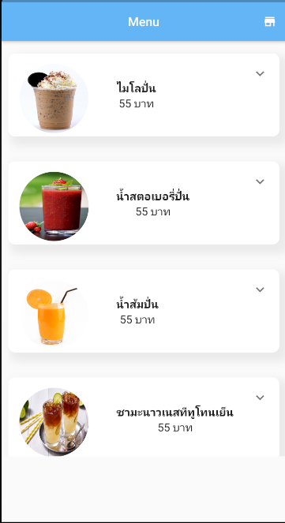
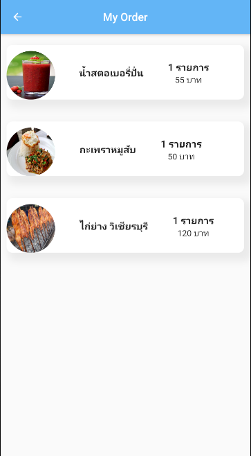

# flutter_demo

A new Flutter project.

## Getting Started

This project is a starting point for a Flutter application.

A few resources to get you started if this is your first Flutter project:

- [Lab: Write your first Flutter app](https://flutter.dev/docs/get-started/codelab)
- [Cookbook: Useful Flutter samples](https://flutter.dev/docs/cookbook)

For help getting started with Flutter, view our
[online documentation](https://flutter.dev/docs), which offers tutorials,
samples, guidance on mobile development, and a full API reference.

## Flutter demo

## Topics

### 1. สร้าง UI 2 หน้า (Menu, Order)

- AppBar, Body

### 2. ใช้ package http จัดการกับ API

- สร้าง class Menu, Order https://javiercbk.github.io/json_to_dart/
- http 0.13.3 https://pub.dev/packages/http
- Get & Post จาก  Mock API => Postman collection ของตัว mock API:  https://www.postman.com/collections/b4403abb2e4dfaf6e8e9

### 3. QR Code scanner
- สร้าง QR Code button
- flutter_barcode_scanner 2.0.0 https://pub.dev/packages/flutter_barcode_scanner
